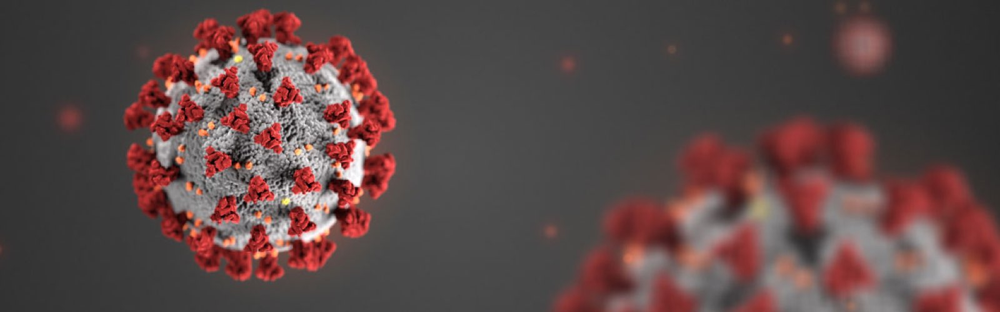

<space>
      

#### By Brittany Shea | Erfan Faridmoayer| Niharika Telrandhe| Pooja Desai | Sabah Usmani

## Motivation
Throughout the course of the COVID-19 pandemic, vaccine availability played a significant role in reduction of new cases, while reducing symptom severity among people who were infected. With the rise of new variants, the need for booster vaccinations with new COVID strain coverage was evident. 

There were widespread reports of lack of vaccine availability in many areas, especially among those with lower socioeconomic status and limited geographic resource availability. 

Given these reports, we wanted to explore the following -

1. Factors that make neighborhoods in NYC vulnerable.
2. Trends in vaccination - how people are vaccinated - fully (FDA approved primary series) , partially( 1-dose of FDA approved primary series)  or with booster (1 complete FDA-approved primary series + additional boosters).
3. How many people are actually getting vaccinated?
COVID-19 vaccination and booster distribution by zip codes and boroughs in NYC as of 2022.
4. Disparities in vaccine distribution with respect to geographic location, poverty status, education attainment and median income.
5. Sociodemographic trends in individuals receiving complete vaccinations and boosters.

## What You'll Find In This Website

- Analyses of various geographic and socioeconomic factors of interest in NYC.
- A closer look at the various demographic, socioeconomic and geographic factors affecting vaccination and booster distribution and uptake across NYC.
- A full report detailing our process [Project Report](file:///Users/niharikatelrandhe/Desktop/P8105%20-%20Data%20Science%201/Niharika_DS.github.io/Project_Report.html)
- A screencast walking you trought this website available on [Youtube](youtubelink)
- Our raw data and analyses can be found on this [GitHub](https://github.com/brittshea/p8105_finalproject_fall2022)

Visualizations and analyses performed using R (v4.0.3) and RStudio (v1.3.1073).
Additional interactivity added using plotly (v4.13.0) and Shiny (v1.5.0).

## About Us

* [Brittany Shea](https://brittshea.github.io)

* [Erfan Faridmoayer](https://erfanfarid.github.io)

* [Niharika Telrandhe](https://niharikavt.github.io/)

* [Pooja Desai](https://www.poojamdesai.com)

* [Sabah Usmani](https://sabah-usmani.github.io/)